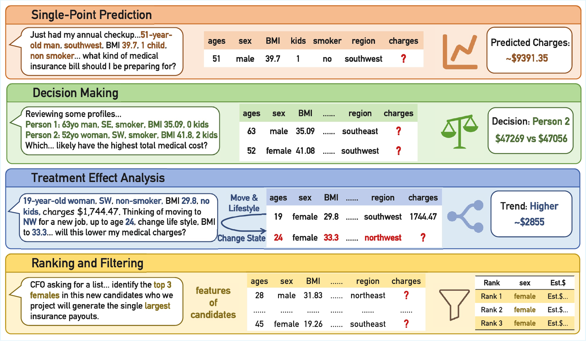

# TopBench

<p align="center">
  <b>TOPBENCH: Benchmarking Predictive Reasoning over Tables</b>
</p>

<p align="center">
  <a href="https://github.com/LAMDA-Tabular/TopBench"></a>
  
  <a href="https://huggingface.co/datasets/LAMDA-Tabular/TopBench"></a>
  
</p>

<p align="center">
  <a href="#overview">Overview</a> |
  <a href="#quick-start">Quick Start</a> |
  <a href="#inference">Inference</a> |
  <a href="#evaluation">Evaluation</a> |
  <a href="#citation">Citation</a>
</p>

---

Official repository for **TopBench**, a benchmark for evaluating whether language models can understand a natural-language predictive intent and solve the corresponding tabular prediction task.

The full dataset is hosted on Hugging Face at [LAMDA-Tabular/TopBench](https://huggingface.co/datasets/LAMDA-Tabular/TopBench). This repository contains the code needed for inference, evaluation, sandboxed tool use, and the predict-only machine-learning baseline.

<p align="center">
  
</p>

## News

- **Initial Release**: We release the TopBench codebase, legacy-compatible reproduction scripts, Docker sandbox setup, and predict-only ensemble baseline.
- **Dataset**: The benchmark data is hosted on [Hugging Face](https://huggingface.co/datasets/LAMDA-Tabular/TopBench) and should be placed under `data/`.

## Overview

TopBench contains four task families:

| Task | Description |
| --- | --- |
| `single_point_prediction` | Predict a missing value or class for one described case. |
| `decision_making` | Select the best option among candidate predictive scenarios. |
| `treatment_effect_analysis` | Estimate the effect or trend after an intervention. |
| `ranking_and_filtering` | Produce a structured CSV ranking or filtered result. |

Legacy names are still supported by the compatibility scripts:

```text
B1 -> single_point_prediction
B2 -> decision_making
B3 -> treatment_effect_analysis
B4 -> ranking_and_filtering
```

## Quick Start

### 1. Install

```bash
conda create -n topbench python=3.10 -y
conda activate topbench
python -m pip install -U pip
python -m pip install -e .
```

For the full predict-only ensemble baseline:

```bash
python -m pip install -r requirements/full.txt
```

### 2. Prepare Data

Download the dataset from Hugging Face:

```bash
python scripts/download_dataset.py --local-dir data
```

Alternatively, place or symlink it as:

```text
data/
  single_point_prediction/
  decision_making/
  treatment_effect_analysis/
  ranking_and_filtering/
```

Check the dataset layout:

```bash
python scripts/validate_dataset.py --data-root data
```

### 3. Configure API Keys

```bash
export DEEPSEEK_API_KEY=your_key_here
```

Other OpenAI-compatible providers can be configured through `.env.example`.

## Inference

Run a small DeepSeek smoke test over all tasks and both modes:

```bash
python scripts/run_legacy_inference.py \
  --data-root data \
  --output-root outputs \
  --model deepseek \
  --tasks single_point_prediction decision_making treatment_effect_analysis ranking_and_filtering \
  --modes text_reasoning agentic_workflow \
  --max-files 1 \
  --workers 1
```

Outputs are written to:

```text
outputs/<model>/<legacy_mode>/<legacy_task>/
```

where `text_reasoning` maps to `no_tool` and `agentic_workflow` maps to `with_tool`.

## Sandbox

The agentic workflow executes model-generated Python code in Docker.

Build and check the sandbox:

```bash
docker build -f docker/Dockerfile.sandbox -t topbench-sandbox:latest .
python scripts/healthcheck_sandbox.py --image topbench-sandbox:latest
```

Use another image tag if needed:

```bash
export TOPBENCH_SANDBOX_IMAGE=topbench-sandbox:latest
```

Text-only inference and the predict-only baseline do not require Docker.

## Evaluation

Evaluate frozen outputs with the bundled compatibility evaluators:

```bash
python scripts/reproduce_paper_scores.py \
  --data-root data \
  --inference-root outputs \
  --task decision_making \
  --model deepseek \
  --mode text_reasoning
```

For the structured ranking/filtering task:

```bash
python scripts/reproduce_paper_scores.py \
  --data-root data \
  --inference-root outputs \
  --task ranking_and_filtering \
  --model deepseek \
  --mode agentic_workflow
```

Summary files can be replayed without overwriting frozen outputs:

```bash
python scripts/reproduce_reasoning_summaries.py \
  --frozen-output-root outputs \
  --model deepseek \
  --mode text_reasoning \
  --compare
```

```bash
python scripts/reproduce_structured_summary.py \
  --data-root data \
  --frozen-output-root outputs \
  --model deepseek \
  --mode agentic_workflow \
  --compare
```

## Predict-Only Baseline

The predict-only baseline uses gold structured data directly and does not use an LLM. It is an adaptive ensemble over strong tabular predictors such as HistGradientBoosting, ExtraTrees, XGBoost, LightGBM, CatBoost, and TabPFN when installed.

Run a smoke test:

```bash
python scripts/run_predict_only_baseline.py \
  --task single_point_prediction \
  --data-root data \
  --output-root outputs \
  --mode predict_only \
  --fast-smoke
```

## Repository Layout

```text
TopBench/
  data/                  # dataset placeholder
  docker/                # sandbox Dockerfile
  scripts/               # inference, evaluation, and baseline entry points
  src/topbench/          # package source
  requirements/          # dependency files
```

## Citation

Citation metadata will be added after publication.
